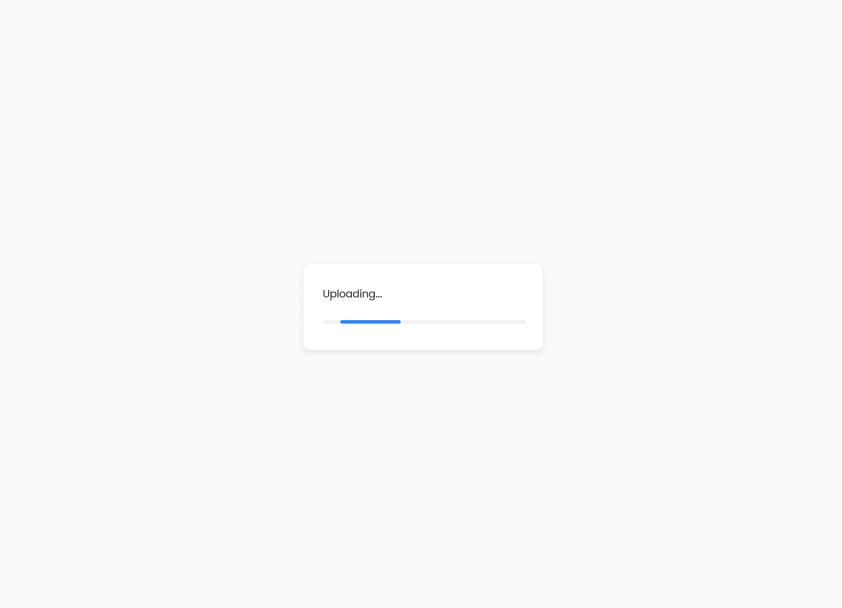

# Image Uploader App

This is an image uploader app built with React, Zustand, Sass, and Firebase. The app allows users to upload images and obtain a link for each uploaded image.

## Table of contents

-   [Overview](#overview)
    -   [Screenshot](#screenshot)
    -   [Links](#links)
-   [Features](#features)
-   [Built with](#built-with)
-   [Installation](#installation)
-   [Configuration](#configuration)
-   [Usage](#usage)
-   [Author](#author)

## Overview

The Image Uploader app provides a user-friendly interface for uploading images and generating links for each uploaded image. It utilizes React for building the user interface, Zustand for state management, Sass for styling, and Firebase for storing the uploaded images.

### Screenshot





### Links

-   Live Site URL: [https://image-uploader-smoky.vercel.app/](https://image-uploader-smoky.vercel.app/)

## Features

-   Upload and store images
-   Generate unique links for each uploaded image
-   Simple and intuitive user interface
-   Responsive design optimized for various devices

### Built with

-   Vite
-   React
-   Drop Zone
-   SASS
-   Firebase

### Installation

To run this project locally, follow these steps:

1. Clone the repository:

```
git clone https://github.com/vishwa-akshat/image-uploader.git

```

2. Navigate to the project directory:

```
cd image-uploader-app

```

3. Install the dependencies using npm:

```
npm install
# or
yarn install

```

### Configuration

Before running the app, you need to configure Firebase with your own credentials. Follow these steps:

-   Go to the Firebase Console.
-   Create a new Firebase project.
-   Retrieve your Firebase configuration details, including the API key, project ID, and storage bucket.
-   Open the src/firebase/index.ts file.
-   Replace the placeholder values with your Firebase configuration details:

```
const firebaseConfig = {
  apiKey: 'YOUR_API_KEY',
  authDomain: 'YOUR_AUTH_DOMAIN',
  projectId: 'YOUR_PROJECT_ID',
  storageBucket: 'YOUR_STORAGE_BUCKET',
  messagingSenderId: 'YOUR_MESSAGING_SENDER_ID',
  appId: 'YOUR_APP_ID',
};

```

### Usage

To start the development server, run:

```
yarn start

```

The app will be accessible at http://localhost:3000

## Author

-   Website - [Akshat Vishwakarma](https://akshat-dev.vercel.app/)
-   Twitter - [@akshatVis](https://twitter.com/akshatVis)
